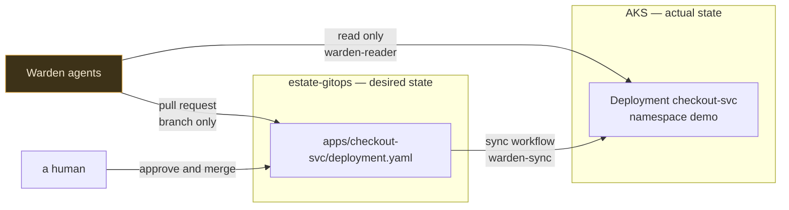

# estate-gitops

The estate [Warden](https://github.com/mazzyy/warden) watches, and the only surface anything in that system can write to.

This is a fake company's production, written down as files. In GitOps the repository is the source of truth for what should be running and the cluster is a reflection of it, so when Warden's remediator wants to fix something it does not reach into Kubernetes — it edits a YAML file and opens a pull request.



The repository is deliberately separate from the agent code. If the two were one, the agent would need write access to its own source and its own permission files. Keeping them apart means the agent proposes changes to the estate, never to itself.

That is also why `rbac/**` is not among the sync workflow's trigger paths. A merged pull request must not be able to widen the permissions of the identity applying it — including its own.

## Layout

```
namespace.yaml                        the blast radius. Every agent manifest pins to `demo`
kustomization.yaml                    composes the namespace and the app in dependency order
apps/checkout-svc/
  deployment.yaml                     what the remediator patches
  service.yaml
  kustomization.yaml
rbac/
  warden-reader.yaml                  the read-only ServiceAccount the agents authenticate as
  warden-sync.yaml                    the CI applier. Namespaced, and holds no delete verb
app/                                  the service source, kept for reference. Not deployed
scripts/
  inject.sh                           break it, restore it
  patch_manifest.py                   targeted regex edits, so the diff stays readable
  extract-reader-credentials.sh       pull the reader token AND the cluster CA
  ci-credentials.sh                   mint the three repository secrets for CI
  verify-rbac.sh                      prove the agents cannot change the cluster
  verify-sync-rbac.sh                 prove CI cannot exceed its namespace
  verify-github-token.sh              prove the agent's token cannot land a change
.github/workflows/sync.yml            merged pull request to cluster
```

## checkout-svc

A small service with two real failure modes. Both are genuine: the process exits, the kubelet restarts it, and `kubectl describe` reports the failure for real reasons. Nothing is simulated, because the hackathon requires unedited live execution and a demo that fakes its own failure proves nothing.

| Injection | Cause | What the cluster reports |
| --- | --- | --- |
| `bad-config` | `PAYMENT_ENDPOINT` scheme `htps` — one missing character | `CrashLoopBackOff`, exit 1 |
| `oom` | `WARMUP_MB=128` against a `64Mi` limit | `OOMKilled`, exit 137 |

The service runs inline on a stock `python:3.12-slim` image, with the whole program in the manifest's `command` and `args`. That is deliberate: building and pushing a custom image would put a registry on the critical path of a demo that does not need one, and the failures are real either way. The equivalent source lives in `app/` for anyone who wants a proper image.

The log line the bad config produces — `FATAL: unsupported URL scheme "htps" in PAYMENT_ENDPOINT` — is byte-identical to what Warden's offline fake estate emits, so the diagnostician behaves the same whether it is reasoning about a real cluster or a fixture.

## First-time setup

```bash
kubectl apply -k .
kubectl apply -f rbac/warden-reader.yaml
kubectl apply -f rbac/warden-sync.yaml
```

RBAC is applied by hand, once, on purpose. It is not swept up by a routine `apply -k .` that a merged pull request could trigger.

Then extract the credentials Warden needs to read the cluster:

```bash
./scripts/extract-reader-credentials.sh
```

It only reads. It prints four lines to paste into `warden/.env`, and it refuses to print anything unless the CA it found actually completes a TLS handshake against your API server first. A CA that does not verify is worse than none, because it fails mid-incident and looks like the cluster went down.

And the three secrets the sync workflow needs:

```bash
./scripts/ci-credentials.sh --set
```

Use `--set` rather than the printing path. It pushes the values through `gh` without the token ever touching your scrollback, and it re-checks the token's scope first, refusing to publish one that can delete, read secrets or escalate.

## Running the demo

```bash
# prove the reader token cannot mutate anything. Keep this output for the video
./scripts/verify-rbac.sh
./scripts/verify-sync-rbac.sh

# break it
./scripts/inject.sh bad-config
kubectl get pods -n demo -w

# wait for the rollout to actually give up — about 45 seconds.
# Then Warden triages, diagnoses, and opens a pull request.
# You review and merge it. sync.yml applies it. The service recovers.

# reset between takes
./scripts/inject.sh restore
```

`inject.sh` commits and pushes the bad change before applying it, rather than poking the cluster behind git's back. That asymmetry is the story — humans break things directly, the agent fixes them through review — and it gives the diagnostician a real ReplicaSet history with a real change-cause to correlate against, which is what turns "the service is down" into "revision 7, commit `72c29df`, four minutes ago, did this."

Rehearse the full sequence three times before recording. The rules forbid editing around a failure, and `restore` before every take is not optional.

### What a blocked rollout looks like

Injecting a bad config usually does **not** take the service down. Kubernetes starts one pod on the new revision, that pod fails, and the rollout stops there — leaving the previous ReplicaSet serving all three replicas. Nothing is unavailable, and nothing is fine either: the estate is pinned to an old revision, the next deploy is stuck behind this one, and the moment a serving pod restarts it comes back on the broken spec.

This state fooled an early version of Warden badly enough to be worth naming here. `3/3 replicas ready` is true throughout, and triage closed the incident as healthy. The status read now checks `updatedReplicas` and the `ProgressDeadlineExceeded` condition rather than ready counts alone.

## The three proofs

Each attempts the forbidden action rather than reading a configuration value, and each is safe to run against a live cluster mid-incident.

**`verify-rbac.sh`** — the agents' read credential. Proves it can read pods and logs and cannot delete, patch, cross a namespace, or read a secret.

**`verify-sync-rbac.sh`** — the CI applier. Proves it can patch deployments in `demo` and nothing else: no delete, no `kube-system`, no secrets, no ClusterRoleBindings, no nodes. It uses `kubectl auth can-i`, so it changes nothing.

**`verify-github-token.sh`** — the agent's GitHub credential. Attempts a direct commit to `main` and reports what actually happened.

### Why verify-rbac.sh exists

The obvious test is wrong:

```bash
kubectl --token=$TOKEN --server=$APISERVER -n demo delete deploy checkout-svc
```

That appears to work — and it deletes the deployment. Not because RBAC failed, but because an AKS admin kubeconfig authenticates with **client certificates**, and Kubernetes accepts a valid client cert regardless of any bearer token you also pass. The `--token` flag is silently ignored and the command runs as cluster-admin.

So the proof proves nothing, and recording it would mean demonstrating a governance guarantee that was never tested. `--kubeconfig=/dev/null` removes the context and its certificates and leaves the token as the only credential in play.

This is the rule the whole project follows: a control you have not seen refuse something is not a control.

## Branch protection

An earlier version of this file said that requiring a pull request before merging is "what makes *no agent can merge its own PR* true in the platform rather than only in the prompt."

That was false, and `verify-github-token.sh` disproved it. With branch protection enabled requiring one approving review, a direct commit to `main` using the agent's own fine-grained token returned **HTTP 201**. The commit landed.

A personal access token inherits the repository role of the human who minted it, and a repository admin bypasses branch protection when `enforce_admins` is false. Narrow scopes decide which repositories and which APIs a token may touch. They do not demote the actor behind it.

The enforceable version is a GitHub App. An App is not a member of the repository and holds no role, so protection applies to it with no bypass to inherit, and an App cannot approve a pull request. Setup is in [`warden/docs/IDENTITY.md`](https://github.com/mazzyy/warden/blob/main/docs/IDENTITY.md).

Current recommended settings:

```bash
gh api -X PUT repos/mazzyy/estate-gitops/branches/main/protection --input - <<'JSON'
{
  "required_status_checks": null,
  "enforce_admins": false,
  "required_pull_request_reviews": {
    "required_approving_review_count": 1,
    "dismiss_stale_reviews": true
  },
  "restrictions": null
}
JSON
```

`enforce_admins` stays false deliberately. Once the agent authenticates as an App it holds no repository role, so the flag was never going to constrain it — turning it on would only constrain you, and it would break `inject.sh`, which needs to push a bad commit straight to `main`. The bypass belongs to the human reviewer, who is the control, not to the thing being controlled.

## The sync workflow

`.github/workflows/sync.yml` is the only thing in the system holding a credential that can change the estate.

It authenticates as `warden-sync`, a ServiceAccount scoped to the `demo` namespace that **cannot delete anything**. `kubectl apply` never needs a delete verb — a removed field is a patch — and without it the worst a merged bad patch can do is roll out a broken pod spec, which Kubernetes refuses to complete while the old ReplicaSet keeps serving.

Before touching the cluster, the workflow re-checks its own credential and fails the job if it turns out to be able to delete deployments, read secrets, or create ClusterRoleBindings. A CI job that can delete a namespace is not a GitOps sync, whatever the file is called.

Its previous design asked for an `AZURE_CREDENTIALS` service principal with Contributor on the resource group — enough to delete the cluster, the node pool and the resource group — in order to patch one Deployment in one namespace. It also had never run.
